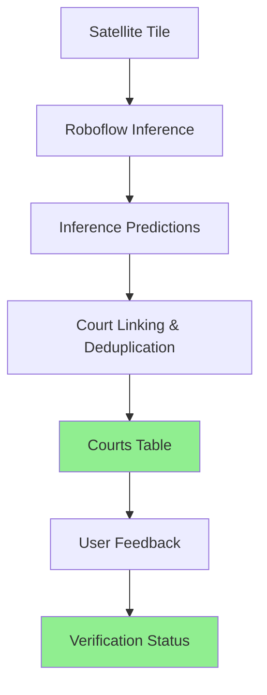
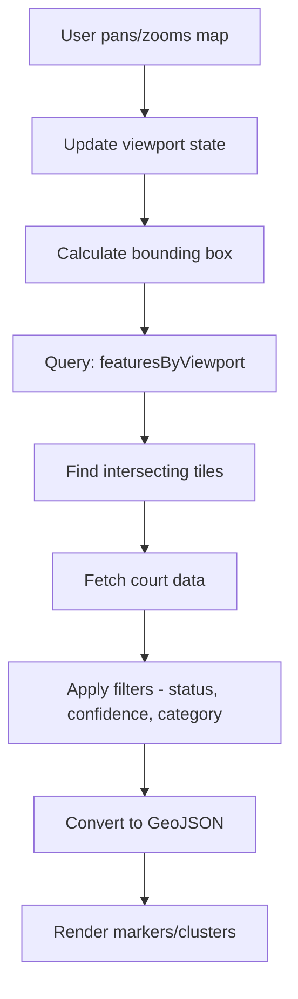
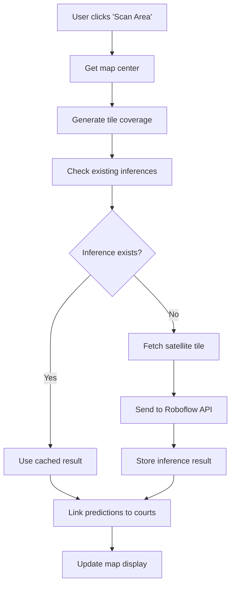
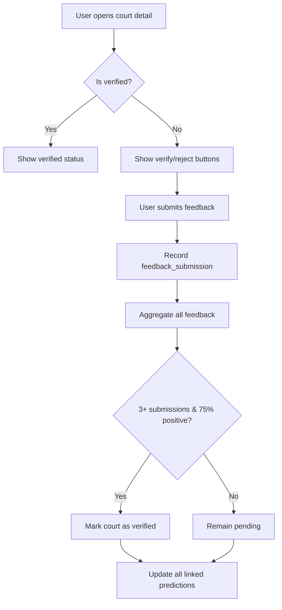

# Map Features Documentation

This document provides a comprehensive overview of the map functionality in the Court Finder application, including architecture, components, data flow, and future development considerations.

## Table of Contents

1. [Architecture Overview](#architecture-overview)
2. [Component Structure](#component-structure)
3. [Core Features](#core-features)
4. [Data Flow](#data-flow)
5. [Key Concepts](#key-concepts)
6. [API Reference](#api-reference)
7. [Configuration](#configuration)
8. [Future Development Considerations](#future-development-considerations)

## Architecture Overview

The map system is built on several key technologies and follows a modular architecture:

### Technology Stack

- **Frontend**: React with [react-map-gl](https://github.com/visgl/react-map-gl) (Mapbox wrapper)
- **Backend**: Convex for real-time data and serverless functions
- **Map Provider**: Mapbox GL JS with satellite imagery
- **AI Detection**: Roboflow for sports facility detection
- **State Management**: TanStack Query for server state, React state for UI

### High-Level Architecture

```
┌─────────────────┐    ┌─────────────────┐    ┌─────────────────┐
│   Map UI/UX     │◄──►│  Data Pipeline  │◄──►│  AI Detection   │
│  (React/Mapbox) │    │   (Convex)      │    │  (Roboflow)     │
└─────────────────┘    └─────────────────┘    └─────────────────┘
         │                        │                        │
         ▼                        ▼                        ▼
┌─────────────────┐    ┌─────────────────┐    ┌─────────────────┐
│ Map Components  │    │ Tile System     │    │ Satellite       │
│ • Markers       │    │ • Z/X/Y coords  │    │ Imagery         │
│ • Clusters      │    │ • GeoJSON       │    │ (Mapbox API)    │
│ • Popups        │    │ • Viewport      │    │                 │
│ • Controls      │    │   queries       │    │                 │
└─────────────────┘    └─────────────────┘    └─────────────────┘
```

## Component Structure

### Directory Organization (`src/components/map/`)

The map components are organized into a modular structure with sections and shared utilities:

```
src/components/map/
├── sections/              # Collapsible control sections
│   ├── ActionButtonsSection.tsx
│   ├── CategoryFilterSection.tsx
│   ├── ConfidenceSection.tsx
│   ├── CourtCountSection.tsx
│   ├── MapStyleSection.tsx
│   ├── StatusFilterSection.tsx
│   └── index.ts
├── shared/
│   └── types.ts           # Shared TypeScript interfaces
├── MapControls.tsx        # Main control panel container
├── CustomNavigationControls.tsx
├── CourtClusters.tsx
├── CourtDetailDrawer.tsx  # NEW: Detailed court information panel
├── CourtMarker.tsx
├── CourtPopup.tsx
├── CourtSatelliteImage.tsx # NEW: Satellite imagery for courts
├── CourtTypePills.tsx     # NEW: Floating filter pills
├── DistanceDisplay.tsx    # NEW: Distance to court
├── FavoriteButton.tsx     # NEW: Save/bookmark courts
├── FloatingSearchBar.tsx  # NEW: Map search functionality
└── ConfidenceSlider.tsx
```

### Component Architecture

#### 1. Map Container (`src/routes/map.tsx`)

The main map component that orchestrates all map functionality:

**Key Responsibilities:**

- Manages map view state (zoom, center, bounds)
- Handles user interactions (clicks, navigation)
- Coordinates data fetching based on viewport
- Persists map state to localStorage
- Manages geolocation and auto-positioning

**Key Features:**

- **View State Management**: Tracks longitude, latitude, and zoom level
- **Auto-geolocation**: Automatically centers on user location on first visit
- **Viewport-based Queries**: Only fetches data for visible area
- **Click Handlers**: Manages cluster expansion and marker selection
- **State Persistence**: Saves/restores map position between sessions

#### 2. Map Controls (`MapControls.tsx`)

The main control panel with collapsible sections (desktop) and drawer (mobile):

**Desktop Layout:**

- Fixed card in bottom-left corner
- Collapsible sections for organized controls

**Mobile Layout:**

- Floating action button (FAB) in bottom-right
- Bottom sheet with controls

**Sections Include:**

- **CourtCountSection**: Displays court count with zoom warning
- **CategoryFilterSection**: Filter court types with visual pills
- **ConfidenceSection**: Confidence threshold slider
- **StatusFilterSection**: Toggle between all/verified courts
- **MapStyleSection**: Switch between map styles
- **ActionButtonsSection**: Scan and upload buttons (admin)

#### 3. Custom Navigation Controls (`CustomNavigationControls.tsx`)

Floating navigation controls for map interactions:

- **Locate Me**: Center on user's current location
- **Compass**: Reset map rotation to north
- **Settings**: Open map settings menu
- **Scan**: Trigger AI analysis (admin only)

#### 4. Court Clusters (`CourtClusters.tsx`)

Handles clustering of court markers at lower zoom levels:

**Implementation Details:**

- Uses Mapbox's native clustering with GeoJSON source
- Dynamic styling based on cluster size
- Color-coded clusters: blue (1-99), yellow (100-749), pink (750+)
- Cluster radius: 50 pixels (configurable via `CLUSTER_RADIUS`)
- Maximum cluster zoom: 12 (configurable via `CLUSTER_MAX_ZOOM`)

**Visual Hierarchy:**

```
Zoom < 10: No courts visible (too zoomed out)
Zoom 10-12: Clustered markers with counts
Zoom ≥ 10: Individual court markers
```

#### 5. Court Markers (`CourtMarker.tsx`)

Individual court markers displayed at high zoom levels:

**Features:**

- Sport-specific emoji icons (🏀 basketball, 🎾 tennis, ⚽ soccer, etc.)
- Status-based styling (verified vs pending)
- Pin-style design with pointing arrow
- Click handlers for detail drawer

**Sport Classifications:**

- Basketball Court: 🏀 (gray background)
- Tennis Court: 🎾 (green background)
- Soccer/Football Field: ⚽ (red background)
- Baseball Diamond: ⚾ (yellow background)
- Track & Field: 🏃 (blue background)

#### 6. Court Detail Drawer (`CourtDetailDrawer.tsx`) **NEW**

Comprehensive court information panel displayed when a court is selected:

**Information Displayed:**

- Court type with emoji and readable name
- Verification status (verified/pending)
- Exact coordinates (6 decimal places)
- AI confidence percentage
- Zoom level where detected
- AI model and version used for detection
- Distance from user (if location available)
- Satellite imagery of court location
- User feedback statistics

**Actions Available:**

- **Get Directions**: Opens native map app or Google Maps
- **Favorite Court**: Save/bookmark for quick access
- **Verify/Reject**: Submit feedback for unverified courts

#### 7. Court Popup (`CourtPopup.tsx`)

Quick information popup for clusters and individual markers:

**Features:**

- Shows cluster count or single court info
- Click to zoom in or open detail drawer
- Compact format for quick scanning

#### 8. Supporting Components

**CourtSatelliteImage.tsx** - Displays cropped satellite imagery of court location

**DistanceDisplay.tsx** - Shows distance from user to court

**FavoriteButton.tsx** - Save/remove court from favorites

**CourtTypePills.tsx** - Floating horizontal filter pills for court types

**FloatingSearchBar.tsx** - Mapbox SearchBox integration for location search

**ConfidenceSlider.tsx** - Slider for adjusting confidence threshold filter

## Core Features

### 1. Court Detection & Display

**Zoom-Based Rendering:**

- Zoom < 10: Clusters only (prevents marker clutter)
- Zoom 10-12: Cluster expansion available
- Zoom ≥ 10: Individual emoji markers visible

**Visual Differentiation:**

- Different colors and emojis for each court type
- Status indicators (verified: green/vibrant, pending: muted)
- Cluster sizing based on court count

### 2. Interactive Features

- **Court Selection**: Click markers to open detailed drawer
- **Cluster Expansion**: Click clusters to zoom into individual courts
- **User Location**: "Locate me" button with geolocation
- **Search**: Mapbox Search API integration for location search
- **Favorites**: Save/bookmark specific courts

### 3. Filtering & Controls

- **Confidence Threshold**: Slider to filter courts by ML confidence (0-100%)
- **Status Filter**: Toggle between showing all, verified only, or pending courts
- **Court Type Filter**: Pills to filter by specific sport types
- **Map Style Switch**: Toggle between satellite/street/dark map styles

### 4. Court Verification System **NEW**

**Community-Driven Verification:**

- Users can verify or reject unverified court predictions
- Feedback from multiple predictions is aggregated
- Courts verified when 3+ submissions with ≥75% positive feedback
- Real-time status updates based on community input

**Feedback Collection:**

- Each user can submit one feedback per court prediction
- Feedback linked to both user and specific court
- System automatically aggregates feedback across predictions
- Tracks positive/negative counts and verification progress

### 5. Court Detail View

**Satellite Image:**

- Cropped satellite view showing exact court location
- Uses tile coordinates and prediction bounding box
- Visual confirmation of court location

**Information Display:**

- Court type, status, confidence
- Detection details (model, version, zoom)
- Distance from user location
- Feedback statistics (for pending courts)

**Actions:**

- Get directions (geo: URL or Google Maps)
- Favorite court
- Verify/Reject court feedback

### 6. Admin Features

**Scan Area:**

- Trigger ML inference on current viewport
- Analyzes satellite tiles for court detection
- Requires `scans.execute` permission

**Upload Training Data:**

- Upload tile images for model training
- Helps improve ML model accuracy
- Requires appropriate permissions

**User Feedback Management:**

- View community verification data
- Track feedback aggregation progress

## Data Flow

### 1. Court-Centric Data Architecture **NEW**

The application has transitioned from a prediction-centric to a court-centric architecture:



**Key Benefits:**

- Multiple predictions link to a single court
- Verification status persists across model updates
- User feedback aggregates at court level
- Better data organization and management

### 2. Viewport-Based Data Fetching



### 3. AI Detection Pipeline



### 4. Court Verification Flow **NEW**



### 5. Tile System Architecture

The application uses a tile-based approach for organizing geographic data:

**Tile Coordinates (Z/X/Y):**

- Z: Zoom level (0-22)
- X: Tile column (west to east)
- Y: Tile row (north to south)

**Tile to Geographic Conversion:**

```typescript
// Convert lat/lng to tile coordinates
const tile = pointToTile(latitude, longitude, zoomLevel);

// Convert tile coordinates back to bounds
const bounds = tileToLngLatBounds(z, x, y);

// Convert pixel position on tile to lat/lng
const coords = pixelOnTileToLngLat(z, x, y, px, py, imageW, imageH);
```

### 6. Database Schema **UPDATED**

**Core Tables:**

```typescript
// Primary court records - NEW
courts: {
  _id: Id<'courts'>;
  location: { type: 'Point', coordinates: [number, number] }; // GeoJSON
  category: string;           // Sport type (e.g., "basketball-court")
  status: 'pending' | 'verified';
  verificationStats: {
    totalSubmissions: number;
    positiveSubmissions: number;
    negativeSubmissions: number;
  };
  _creationTime: number;
  linkedPredictionIds: Id<'inference_predictions'>[];
}

// Inference results per tile
inferences: {
  z: number;           // Tile zoom level
  x: number;           // Tile X coordinate
  y: number;           // Tile Y coordinate
  imageUrl: string;    // Satellite image URL
  model: string;       // AI model name
  version: string;     // AI model version
  requestedAt: number; // Timestamp
  response: any;       // Roboflow API response
}

// Individual sport facility detections
inference_predictions: {
  inferenceId: Id<'inferences'>;
  courtId: Id<'courts'>;  // NEW: Links to court
  class: string;       // Sport type (e.g., "tennis-court")
  confidence: number;  // AI confidence (0-1)
  x: number;          // Pixel X in source image
  y: number;          // Pixel Y in source image
  width: number;      // Bounding box width
  height: number;     // Bounding box height
  detectionId: string; // Unique detection ID
}

// User feedback for court verification - NEW
feedback_submissions: {
  courtId: Id<'courts'>;
  predictionId: Id<'inference_predictions'>;
  userId: Id<'users'>;
  isPositive: boolean; // true = verify, false = reject
  _creationTime: number;
}

// Scan operations (user-initiated)
scans: {
  centerLat: number;
  centerLong: number;
  centerTile: TileCoordinate;
  tiles: TileCoordinate[];
  userId: Id<'users'>;
}
```

## Key Concepts

### 1. Zoom-Based Visibility **UPDATED**

The map uses zoom levels to control information density:

- **Zoom < 10**: No courts visible (performance optimization)
- **Zoom 10-12**: Clustered markers to reduce visual clutter
- **Zoom ≥ 10**: Individual court markers with full detail

This prevents overwhelming users with thousands of markers at low zoom levels.

### 2. Court Verification System **NEW**

Community-driven verification ensures court accuracy:

- **Pending Courts**: Unverified AI detections
- **Verified Courts**: Confirmed by community (3+ submissions, ≥75% positive)
- **Feedback Aggregation**: Multiple predictions link to single court
- **Real-time Updates**: Status changes immediately upon verification

**Verification Requirements:**

- Minimum 3 user submissions
- Minimum 75% positive feedback
- One submission per user per prediction

### 3. Confidence Filtering

All AI detections include a confidence score (0-100%). Users can filter results to show only high-confidence detections, which helps reduce false positives.

**Recommended Thresholds:**

- 30-40%: Show all potential courts (may include false positives)
- 50-60%: Balanced view (default)
- 70%+: High confidence only (may miss some valid courts)

### 4. Multi-Zoom Data Strategy

The system stores inference results at multiple zoom levels to balance detail and coverage:

- **High zoom (15-18)**: Detailed analysis of smaller areas
- **Medium zoom (13-14)**: Broader coverage with good accuracy
- **Low zoom (11-12)**: Wide area coverage (when available)

### 5. Tile-Based Caching

Satellite imagery and AI analysis results are cached per tile to improve performance:

- **Cache Key**: `${z}-${x}-${y}-${model}-${version}`
- **Cache Strategy**: Permanent storage (satellite imagery doesn't change frequently)
- **Cache Benefits**: Instant loading for previously analyzed areas

### 6. Multi-Model Support

The map displays inference data from any AI model while intelligently handling conflicts:

- **Model Agnostic**: Shows courts detected by any model or version
- **Latest Preference**: When multiple inferences exist for the same tile, the most recent one is used
- **Model Transparency**: Court popup displays which model and version detected each court
- **Seamless Experience**: Users see all available data without needing to select specific models

### 7. Court-Centric Architecture **NEW**

The application now uses a court-centric data model:

- **Single Source of Truth**: Courts table is the primary record
- **Prediction Linking**: Multiple predictions can link to one court
- **Persistent Status**: Verification status survives model updates
- **Deduplication**: Automatic merging of duplicate detections

## API Reference

### Frontend Queries

#### `api.inferences.featuresByViewport`

Fetches all courts visible in the current map viewport from any model, preferring the latest inference for each tile.

```typescript
const featureCollection = useQuery(api.inferences.featuresByViewport, {
  bbox: {
    minLat: number,
    minLng: number,
    maxLat: number,
    maxLng: number,
  },
  zoom: number,
  confidenceThreshold: number,
  statusFilter?: 'all' | 'verified' | 'pending',
  categoryFilter?: string[],
});
```

#### `api.inferences.getCourtImageData` **NEW**

Gets satellite tile data for a specific court.

```typescript
const courtImageData = useQuery(api.inferences.getCourtImageData, {
  courtId: Id<'courts'>,
});
```

#### `api.feedback_submissions.getUserFeedbackForPrediction` **NEW**

Checks if user has submitted feedback for a specific prediction.

```typescript
const userFeedback = useQuery(api.feedback_submissions.getUserFeedbackForPrediction, {
  predictionId: Id<'inference_predictions'>,
});
```

#### `api.inferences.getAvailableZoomLevels`

Gets all zoom levels with available data across all models.

```typescript
const zoomLevels = useQuery(api.inferences.getAvailableZoomLevels, {});
```

#### `api.users.hasPermission`

Checks if current user can perform specific actions.

```typescript
const canScan = useQuery(api.users.hasPermission, {
  permission: 'scans.execute',
});
```

### Frontend Mutations

#### `api.feedback_submissions.submitFeedback` **NEW**

Submit user feedback for court verification.

```typescript
const submitFeedback = useMutation(api.feedback_submissions.submitFeedback);

// Usage
submitFeedback({
  predictionId: Id<'inference_predictions'>,
  courtId: Id<'courts'>,
  isPositive: boolean,
});
```

### Backend Actions

#### `api.actions.scanArea`

Triggers AI analysis of the area around a specified point.

```typescript
const scanMutation = useMutation({
  mutationFn: async () => {
    return scanArea({
      latitude: number,
      longitude: number,
    });
  },
});
```

#### `api.upload_batches.uploadCenterTile` **UPDATED**

Uploads the center tile as training data for ML model improvement.

## Configuration

### Environment Variables

```bash
# Required for map display and satellite imagery
VITE_MAPBOX_API_KEY=pk.your_mapbox_token

# Required for AI detection (backend only)
MAPBOX_API_KEY=pk.your_mapbox_token
ROBOFLOW_API_KEY=your_roboflow_key
```

### Frontend Constants (`src/lib/constants.ts`) **UPDATED**

```typescript
// Map rendering thresholds
export const PINS_VISIBLE_FROM_ZOOM = 10; // CHANGED from 12

// Map defaults
export const DEFAULT_MAP_CENTER: [number, number] = [-87.6952, 41.9442]; // Chicago
export const DEFAULT_MAP_ZOOM = 15;
export const MAP_STYLE_SATELLITE = 'mapbox://styles/mapbox/satellite-v9';

// Clustering
export const CLUSTER_MAX_ZOOM = 12; // CHANGED from 14
export const CLUSTER_RADIUS = 50;

// Note: AI Model constants are no longer used in frontend
// The map now displays data from any model automatically

// UI
export const CONFIDENCE_SLIDER_STEP = 0.1;
export const FLY_TO_DURATION_MS = 800;

// Court verification thresholds - NEW
export const VERIFICATION_MIN_SUBMISSIONS = 3;
export const VERIFICATION_POSITIVE_THRESHOLD = 0.75; // 75%
```

### Backend Constants (`convex/lib/constants.ts`)

```typescript
// Permissions
export const PERMISSIONS = {
  SCANS: {
    READ: 'scans.read',
    WRITE: 'scans.write',
    EXECUTE: 'scans.execute',
  },
};

// Tile processing
export const DEFAULT_TILE_RADIUS = 1;
export const MAPBOX_TILE_DEFAULTS = {
  username: 'mapbox',
  styleId: 'satellite-v9',
  tileSize: 512,
  zoom: 15,
};

// Court verification - NEW
export const VERIFICATION_CONFIG = {
  MIN_SUBMISSIONS: 3,
  POSITIVE_THRESHOLD: 0.75, // 75% must be positive
};
```

## Future Development Considerations

### 1. Performance Optimizations

**Current State:**

- Mapbox native clustering handles large datasets well
- Zoom-based visibility prevents marker overload
- Stable state management during API refetches

**Potential Improvements:**

- Implement marker aggregation for extremely dense areas
- Add query result pagination/windowing
- Optimize GeoJSON feature generation
- Consider WebGL marker rendering for 10,000+ courts

### 2. Data Management

**Current State:**

- Court-centric architecture with deduplication
- Permanent storage for inference results
- No data expiration/cleanup strategy

**Potential Enhancements:**

- Add data retention policies for old predictions
- Implement progressive data loading
- Add offline map tile caching
- Consider data compression for large inference responses

### 3. User Experience

**Enhancement Opportunities:**

- **Smart Zoom**: Automatically adjust zoom based on court density
- **Area Analysis**: Show statistics for selected regions
- **Route Planning**: Multi-stop route planning for court tours
- **Advanced Filters**: Filter by amenities, lighting, surface type
- **Social Features**: Share courts, check-ins, photos

### 4. AI/ML Improvements

**Current Model:**

- Single model for all sport types
- Community feedback for verification
- No temporal analysis

**Future Enhancements:**

- Sport-specific detection models
- Temporal analysis for seasonal facilities
- Active learning from user feedback
- Confidence calibration based on real-world validation
- Ensemble models for improved accuracy

### 5. Mobile Experience

**Current State:**

- Responsive design with mobile controls
- Touch-optimized interactions
- Bottom sheet controls on mobile

**Enhancement Ideas:**

- **GPS Integration**: Background location tracking for nearby courts
- **Offline Mode**: Cache frequently accessed areas
- **Native Features**: Camera integration for field validation
- **Push Notifications**: Alert users to new verified courts nearby
- **PWA Improvements**: Better install experience, app shortcuts

### 6. Integration Possibilities

**External Services:**

- **Google Maps/Apple Maps**: Enhanced deep linking
- **Fitness Apps**: Integration with Strava, Apple Health, etc.
- **Reservation Systems**: Link to court booking platforms
- **Weather Services**: Show current conditions for outdoor courts
- **Social Media**: Share courts on social platforms

### 7. Analytics and Monitoring

**Current Gaps:**

- No user interaction tracking
- Limited performance monitoring
- No A/B testing framework

**Recommended Additions:**

- User behavior analytics
- Map performance metrics
- AI model accuracy tracking
- Feature usage statistics
- Verification rate analysis

### 8. Accessibility

**Current Implementation:**

- Basic keyboard navigation
- ARIA labels on interactive elements

**Future Improvements:**

- Screen reader optimizations for map interactions
- High contrast mode support
- Voice navigation integration
- Reduced motion preferences
- Keyboard-only map navigation

### 9. Internationalization

**Considerations for Global Expansion:**

- Multi-language sport facility names
- Regional map style preferences
- Different coordinate system support
- Localized map data sources
- Regional sport type variations

### 10. Developer Experience

**Documentation Needs:**

- API documentation improvements
- Component storybook
- Testing strategy documentation
- Deployment and scaling guides

**Tooling Improvements:**

- Better type safety for GeoJSON operations
- Development map style for testing
- Mock data generators for development
- Automated testing for map interactions
- Visual regression testing for map rendering

---

## Getting Started for New Developers

1. **Setup Environment**: Ensure Mapbox and Roboflow API keys are configured
2. **Understand Data Flow**: Start with `src/routes/map.tsx` to understand the main data flow
3. **Explore Components**: Review map components in `src/components/map/`
4. **Review Sections**: Understand the modular control sections architecture
5. **Study Backend**: Examine `convex/inferences.ts` for data queries and court linking logic
6. **Learn Tile System**: Understand `convex/lib/tiles.ts` for coordinate transformations
7. **Review Verification**: Study the feedback and verification system in `convex/feedback_submissions.ts`
8. **Test Interactions**: Use the confidence slider, status filters, and zoom controls to understand behavior

## Recent Architecture Changes

### Court-Centric Migration (2024)

The application migrated from a prediction-centric to a court-centric architecture:

- **Before**: Each inference prediction was treated as an independent court
- **After**: Multiple predictions link to a single court record

**Benefits:**
- Verification status persists across model updates
- Better deduplication of detections
- Community feedback aggregates at court level
- Cleaner data organization

**Migration Impact:**
- New `courts` table as primary data source
- `inference_predictions` now have `courtId` field
- New `feedback_submissions` table for verification
- Query refactoring from `courts:listByViewport` to `inferences:featuresByViewport`

### Zoom Threshold Updates

Zoom thresholds were adjusted for better user experience:

- `PINS_VISIBLE_FROM_ZOOM`: 12 → 10
- `CLUSTER_MAX_ZOOM`: 14 → 12

This allows courts to be visible at lower zoom levels.

---

This documentation should be updated as the map features evolve. Key areas to monitor for changes include the court verification system, AI model updates, performance optimizations, and new user experience features.
