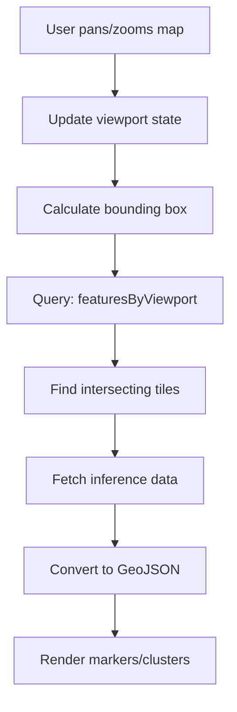
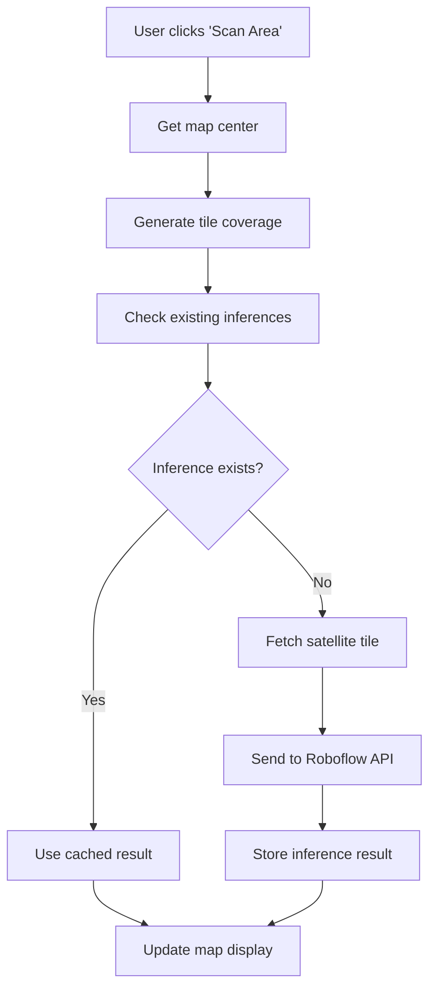

# Map Features Documentation

This document provides a comprehensive overview of the map functionality in the Court Finder application, including architecture, components, data flow, and future development considerations.

## Table of Contents

1. [Architecture Overview](#architecture-overview)
2. [Core Components](#core-components)
3. [Data Flow](#data-flow)
4. [Key Concepts](#key-concepts)
5. [API Reference](#api-reference)
6. [Configuration](#configuration)
7. [Future Development Considerations](#future-development-considerations)

## Architecture Overview

The map system is built on several key technologies and follows a modular architecture:

### Technology Stack

- **Frontend**: React with [react-map-gl](https://github.com/visgl/react-map-gl) (Mapbox wrapper)
- **Backend**: Convex for real-time data and serverless functions
- **Map Provider**: Mapbox GL JS with satellite imagery
- **AI Detection**: Roboflow for sports facility detection
- **State Management**: TanStack Query for server state, React state for UI

### High-Level Architecture

```
┌─────────────────┐    ┌─────────────────┐    ┌─────────────────┐
│   Map UI/UX     │◄──►│  Data Pipeline  │◄──►│  AI Detection   │
│  (React/Mapbox) │    │   (Convex)      │    │  (Roboflow)     │
└─────────────────┘    └─────────────────┘    └─────────────────┘
         │                        │                        │
         ▼                        ▼                        ▼
┌─────────────────┐    ┌─────────────────┐    ┌─────────────────┐
│ Map Components  │    │ Tile System     │    │ Satellite       │
│ • Markers       │    │ • Z/X/Y coords  │    │ Imagery         │
│ • Clusters      │    │ • GeoJSON       │    │ (Mapbox API)    │
│ • Popups        │    │ • Viewport      │    │                 │
│ • Controls      │    │   queries       │    │                 │
└─────────────────┘    └─────────────────┘    └─────────────────┘
```

## Core Components

### 1. Map Container (`src/routes/map.tsx`)

The main map component that orchestrates all map functionality:

**Key Responsibilities:**

- Manages map view state (zoom, center, bounds)
- Handles user interactions (clicks, navigation)
- Coordinates data fetching based on viewport
- Persists map state to localStorage
- Manages geolocation and auto-positioning

**Key Features:**

- **View State Management**: Tracks longitude, latitude, and zoom level
- **Auto-geolocation**: Automatically centers on user location on first visit
- **Viewport-based Queries**: Only fetches data for visible area
- **Click Handlers**: Manages cluster expansion and marker selection
- **State Persistence**: Saves/restores map position between sessions

### 2. Court Clusters (`src/components/map/CourtClusters.tsx`)

Handles clustering of court markers at lower zoom levels:

**Implementation Details:**

- Uses Mapbox's native clustering with GeoJSON source
- Dynamic styling based on cluster size
- Color-coded clusters: blue (1-99), yellow (100-749), pink (750+)
- Cluster radius: 50 pixels (configurable via `CLUSTER_RADIUS`)
- Maximum cluster zoom: 14 (configurable via `CLUSTER_MAX_ZOOM`)

**Visual Hierarchy:**

```
Zoom ≤ 12: No courts visible (too zoomed out)
Zoom 13-14: Clustered markers with counts
Zoom > 14: Individual court markers
```

### 3. Court Markers (`src/components/map/CourtMarker.tsx`)

Individual court markers displayed at high zoom levels:

**Features:**

- Sport-specific emoji icons (🏀 basketball, 🎾 tennis, ⚽ soccer, etc.)
- Color-coded backgrounds based on sport type
- Pin-style design with pointing arrow
- Click handlers for popup display

**Sport Classifications:**

- Basketball Court: 🏀 (gray background)
- Tennis Court: 🎾 (green background)
- Soccer/Football Field: ⚽ (red background)
- Baseball Diamond: ⚾ (yellow background)
- Track & Field: 🏃 (blue background)
- Swimming Pool: 🏊 (cyan background)
- Unknown: ❓ (blue background)

### 4. Court Popup (`src/components/map/CourtPopup.tsx`)

Information panel displayed when a court is selected:

**Information Displayed:**

- Sport type with emoji and readable name
- Exact coordinates (6 decimal places)
- AI confidence percentage
- Zoom level where detected
- AI model and version used for detection
- "Open in Maps" button with smart navigation

**Smart Navigation:**

- Attempts `geo:` URL scheme first (opens native map app)
- Falls back to Google Maps web interface
- Works on both mobile and desktop

### 5. Map Controls (`src/components/map/MapControls.tsx`)

Control panel providing user interface for map interactions:

**Desktop Layout:**

- Fixed card in bottom-left corner
- Always visible and accessible

**Mobile Layout:**

- Floating action button (FAB) in bottom-right
- Bottom sheet with controls

**Features:**

- **Mapbox SearchBox**: Location search and navigation
- **Zoom Display**: Current zoom level and pin visibility threshold
- **Confidence Slider**: Filter courts by AI confidence (0-100%)
- **Court Counter**: Shows number of visible courts
- **Data Availability**: Displays available zoom levels
- **Scan Button**: Trigger AI analysis of current area (requires permissions)

### 6. Confidence Slider (`src/components/map/ConfidenceSlider.tsx`)

Allows filtering of court markers by AI detection confidence:

**Configuration:**

- Range: 0% to 100%
- Step: 10% (configurable via `CONFIDENCE_SLIDER_STEP`)
- Default: 50%
- Real-time filtering (no debouncing needed due to optimized queries)

## Data Flow

### 1. Viewport-Based Data Fetching



### 2. AI Detection Pipeline



### 3. Tile System Architecture

The application uses a tile-based approach for organizing geographic data:

**Tile Coordinates (Z/X/Y):**

- Z: Zoom level (0-22)
- X: Tile column (west to east)
- Y: Tile row (north to south)

**Tile to Geographic Conversion:**

```typescript
// Convert lat/lng to tile coordinates
const tile = pointToTile(latitude, longitude, zoomLevel);

// Convert tile coordinates back to bounds
const bounds = tileToLngLatBounds(z, x, y);

// Convert pixel position on tile to lat/lng
const coords = pixelOnTileToLngLat(z, x, y, px, py, imageW, imageH);
```

### 4. Database Schema

**Core Tables:**

```typescript
// Inference results per tile
inferences: {
  z: number;           // Tile zoom level
  x: number;           // Tile X coordinate
  y: number;           // Tile Y coordinate
  imageUrl: string;    // Satellite image URL
  model: string;       // AI model name
  version: string;     // AI model version
  requestedAt: number; // Timestamp
  response: any;       // Roboflow API response
}

// Individual sport facility detections
inference_predictions: {
  inferenceId: Id<'inferences'>;
  class: string;       // Sport type (e.g., "tennis-court")
  confidence: number;  // AI confidence (0-1)
  x: number;          // Pixel X in source image
  y: number;          // Pixel Y in source image
  width: number;      // Bounding box width
  height: number;     // Bounding box height
  detectionId: string; // Unique detection ID
}

// Scan operations (user-initiated)
scans: {
  centerLat: number;
  centerLong: number;
  centerTile: TileCoordinate;
  tiles: TileCoordinate[];
  userId: Id<'users'>;
}
```

## Key Concepts

### 1. Zoom-Based Visibility

The map uses zoom levels to control information density:

- **Zoom < 12**: No courts visible (performance optimization)
- **Zoom 12-14**: Clustered markers to reduce visual clutter
- **Zoom > 14**: Individual court markers with full detail

This prevents overwhelming users with thousands of markers at low zoom levels.

### 2. Confidence Filtering

All AI detections include a confidence score (0-100%). Users can filter results to show only high-confidence detections, which helps reduce false positives.

**Recommended Thresholds:**

- 30-40%: Show all potential courts (may include false positives)
- 50-60%: Balanced view (default)
- 70%+: High confidence only (may miss some valid courts)

### 3. Multi-Zoom Data Strategy

The system stores inference results at multiple zoom levels to balance detail and coverage:

- **High zoom (15-18)**: Detailed analysis of smaller areas
- **Medium zoom (13-14)**: Broader coverage with good accuracy
- **Low zoom (11-12)**: Wide area coverage (when available)

### 4. Tile-Based Caching

Satellite imagery and AI analysis results are cached per tile to improve performance:

- **Cache Key**: `${z}-${x}-${y}-${model}-${version}`
- **Cache Strategy**: Permanent storage (satellite imagery doesn't change frequently)
- **Cache Benefits**: Instant loading for previously analyzed areas

### 5. Multi-Model Support

The map displays inference data from any AI model while intelligently handling conflicts:

- **Model Agnostic**: Shows courts detected by any model or version
- **Latest Preference**: When multiple inferences exist for the same tile, the most recent one is used
- **Model Transparency**: Court popup displays which model and version detected each court
- **Seamless Experience**: Users see all available data without needing to select specific models

## API Reference

### Frontend Queries

#### `api.inferences.featuresByViewport`

Fetches all courts visible in the current map viewport from any model, preferring the latest inference for each tile.

```typescript
const featureCollection = useQuery(api.inferences.featuresByViewport, {
  bbox: {
    minLat: number,
    minLng: number,
    maxLat: number,
    maxLng: number,
  },
  zoom: number,
  confidenceThreshold: number,
});
```

#### `api.inferences.getAvailableZoomLevels`

Gets all zoom levels with available data across all models.

```typescript
const zoomLevels = useQuery(api.inferences.getAvailableZoomLevels, {});
```

#### `api.users.hasPermission`

Checks if current user can perform specific actions.

```typescript
const canScan = useQuery(api.users.hasPermission, {
  permission: 'scans.execute',
});
```

### Backend Actions

#### `api.actions.scanArea`

Triggers AI analysis of the area around a specified point.

```typescript
const scanMutation = useMutation({
  mutationFn: async () => {
    return scanArea({
      latitude: number,
      longitude: number,
    });
  },
});
```

## Configuration

### Environment Variables

```bash
# Required for map display and satellite imagery
VITE_MAPBOX_API_KEY=pk.your_mapbox_token

# Required for AI detection (backend only)
MAPBOX_API_KEY=pk.your_mapbox_token
ROBOFLOW_API_KEY=your_roboflow_key
```

### Constants (`src/lib/constants.ts`)

```typescript
// Map rendering thresholds
export const PINS_VISIBLE_FROM_ZOOM = 12;

// Map defaults
export const DEFAULT_MAP_CENTER: [number, number] = [-87.6952, 41.9442]; // Chicago
export const DEFAULT_MAP_ZOOM = 15;
export const MAP_STYLE_SATELLITE = 'mapbox://styles/mapbox/satellite-v9';

// Clustering
export const CLUSTER_MAX_ZOOM = 14;
export const CLUSTER_RADIUS = 50;

// Note: AI Model constants are no longer used in frontend
// The map now displays data from any model automatically

// UI
export const CONFIDENCE_SLIDER_STEP = 0.1;
export const FLY_TO_DURATION_MS = 800;
```

### Backend Constants (`convex/lib/constants.ts`)

```typescript
// Permissions
export const PERMISSIONS = {
  SCANS: {
    READ: 'scans.read',
    WRITE: 'scans.write',
    EXECUTE: 'scans.execute',
  },
};

// Tile processing
export const DEFAULT_TILE_RADIUS = 1;
export const MAPBOX_TILE_DEFAULTS = {
  username: 'mapbox',
  styleId: 'satellite-v9',
  tileSize: 512,
  zoom: 15,
};
```

## Future Development Considerations

### 1. Performance Optimizations

**Current Bottlenecks:**

- Large viewport queries at high zoom levels
- Real-time confidence filtering on large datasets
- Marker rendering performance with 1000+ courts

**Recommended Improvements:**

- Implement marker clustering at component level (not just Mapbox)
- Add query result pagination/windowing
- Optimize GeoJSON feature generation
- Consider WebGL marker rendering for large datasets

### 2. Data Management

**Current Limitations:**

- No data expiration/cleanup strategy
- Growing database with permanent tile storage
- No offline support

**Recommended Enhancements:**

- Add data retention policies
- Implement progressive data loading
- Add offline map tile caching
- Consider data compression for large inference responses

### 3. User Experience

**Enhancement Opportunities:**

- **Smart Zoom**: Automatically adjust zoom based on court density
- **Area Analysis**: Show statistics for selected regions
- **Route Planning**: Integration with navigation apps
- **Favorites**: Allow users to save/bookmark courts
- **Filters**: Additional filtering by sport type, amenities, etc.

### 4. AI/ML Improvements

**Current Model Limitations:**

- Single model for all sport types
- No temporal analysis (courts can be seasonal)
- No accuracy tracking over time

**Future Enhancements:**

- Sport-specific detection models
- Temporal analysis for seasonal facilities
- User feedback integration for model improvement
- Confidence calibration based on real-world validation

### 5. Mobile Experience

**Current State:**

- Responsive design with mobile controls
- Touch-optimized interactions

**Enhancement Ideas:**

- **GPS Integration**: Better location tracking
- **Offline Mode**: Cache frequently accessed areas
- **Native Features**: Camera integration for field validation
- **Push Notifications**: Alert users to new courts nearby

### 6. Integration Possibilities

**External Services:**

- **Google Maps/Apple Maps**: Deep linking improvements
- **Fitness Apps**: Integration with Strava, Apple Health, etc.
- **Reservation Systems**: Link to court booking platforms
- **Weather Services**: Show current conditions for outdoor courts

### 7. Analytics and Monitoring

**Current Gaps:**

- No user interaction tracking
- Limited performance monitoring
- No A/B testing framework

**Recommended Additions:**

- User behavior analytics
- Map performance metrics
- AI model accuracy tracking
- Feature usage statistics

### 8. Accessibility

**Current Implementation:**

- Basic keyboard navigation
- ARIA labels on interactive elements

**Future Improvements:**

- Screen reader optimizations
- High contrast mode support
- Voice navigation integration
- Reduced motion preferences

### 9. Internationalization

**Considerations for Global Expansion:**

- Multi-language sport facility names
- Regional map style preferences
- Different coordinate system support
- Localized map data sources

### 10. Developer Experience

**Documentation Needs:**

- API documentation improvements
- Component storybook
- Testing strategy documentation
- Deployment and scaling guides

**Tooling Improvements:**

- Better type safety for GeoJSON operations
- Development map style for testing
- Mock data generators for development
- Automated testing for map interactions

---

## Getting Started for New Developers

1. **Setup Environment**: Ensure Mapbox and Roboflow API keys are configured
2. **Understand Data Flow**: Start with `src/routes/map.tsx` to understand the main data flow
3. **Explore Components**: Review each map component individually
4. **Test Interactions**: Use the confidence slider and zoom controls to understand behavior
5. **Review Backend**: Examine `convex/inferences.ts` for data queries
6. **Study Tile System**: Understand `convex/lib/tiles.ts` for coordinate transformations

This documentation should be updated as the map features evolve. Key areas to monitor for changes include the AI model configuration, performance optimizations, and new user experience features.
